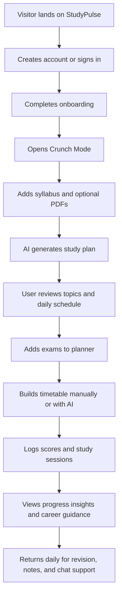

## 1. Product Overview
StudyPulse is an AI-powered student academic command center that helps students move from urgent exam prep to longer-term academic planning in one workspace.
- It solves two problems: students often do not know what to study first under time pressure, and they struggle to keep exams, scores, notes, and routines organised over time.
- The product targets secondary, undergraduate, and postgraduate students globally, with an MVP focused on fast setup, useful AI outputs, and dependable daily planning.

## 2. Core Features

### 2.1 User Roles
| Role | Registration Method | Core Permissions |
|------|---------------------|------------------|
| Student | Email/password or Google OAuth | Manage exams, generate AI study plans, build timetables, track scores, write notes, view career guidance |

### 2.2 Feature Module
1. **Public landing page**: hero, live demo, feature grid, pricing, FAQ, footer
2. **Authentication pages**: sign up, sign in, session recovery entry points
3. **Crunch Mode page**: syllabus input, PDF upload, AI study plan generation, topic cards, daily schedule, quiz trigger
4. **Planner page**: exam calendar, exam form, exam countdown cards, export action
5. **Timetable page**: weekly grid, slot creation, blocked slots, AI timetable generation, export/print actions
6. **Tracker page**: score logger, performance charts, study heatmap, streak summary, AI insight panel
7. **Career page**: onboarding quiz, career path summary, milestone guidance, subject relevance
8. **Notes page**: rich text note editor, list/search, AI annotation tools, tag support
9. **Settings and onboarding**: profile, preferences, notifications, subjects, plan details, first-time setup

### 2.3 Page Details
| Page Name | Module Name | Feature description |
|-----------|-------------|---------------------|
| Landing | Hero | Clear value proposition, CTA to start, CTA to explore demo |
| Landing | Live demo | Interactive static example of a generated study plan |
| Landing | Features and pricing | Summarises Crunch Mode, planner, timetable, tracker, career, notes, and free/pro plans |
| Login / Signup | Auth forms | Email/password auth, Google entry point, validation and friendly errors |
| Crunch | Syllabus input | Subject, exam timing, study hours, level, exam board, syllabus textarea |
| Crunch | PDF upload | Upload PDF notes, display file state, show extraction summary |
| Crunch | AI result area | Render strategy, red flags, priority topics, daily schedule, quiz launcher |
| Planner | Calendar | Month/week toggle, exam listing, countdown badges, conflict warnings |
| Planner | Exam modal/form | Create and edit exams with metadata and colour |
| Timetable | Weekly grid | 7-column study schedule from 06:00 to 23:00 |
| Timetable | Slot editor | Add study or blocked time slots with recurrence settings |
| Timetable | AI timetable | Generate schedule from exams and availability, render into grid |
| Tracker | Score logger | Save subject scores, notes, dates, and test types |
| Tracker | Analytics | Line chart, radar chart, study heatmap, streak counter, subject cards |
| Career | Career onboarding | Capture subjects, interests, ambitions, and destination goals |
| Career | Career path map | Show 3 AI-suggested pathways with milestones and subject insights |
| Notes | Note workspace | Rich text editing, tagging, search, AI annotations, export options |
| Settings | Profile and preferences | Update profile, notification choices, study preferences, subjects, plan info, data export |
| Onboarding | Guided setup | Collect student basics, first exam, subjects, and study preferences |

## 3. Core Process
The student lands on the public page, signs up, and completes onboarding. From there, the core MVP flow begins in Crunch Mode: the user enters a subject and syllabus or uploads PDF notes, then receives a prioritised study plan with explanations and a day-by-day schedule. They can then add exams in the planner, generate a weekly timetable around blocked time, log results in the tracker, and maintain notes and career direction over time.

## 4. User Interface Design
### 4.1 Design Style
- Primary colors: deep navy, off-white, electric blue accent, soft orange warning accent
- Button style: rounded, compact, high-contrast, with subtle elevation and hover lift
- Typography: editorial display font for key headers, highly readable sans-serif for product UI
- Layout style: dashboard-first cards and panels with strong hierarchy, generous spacing, and persistent navigation
- Icon style suggestions: clean line icons from Lucide with restrained use of status colour

### 4.2 Page Design Overview
| Page Name | Module Name | UI Elements |
|-----------|-------------|-------------|
| Landing | Hero | Bold headline, supporting proof text, two CTAs, decorative study-themed backdrop |
| Landing | Demo | Static AI plan cards that behave like the real dashboard cards |
| Dashboard pages | Shell | Left sidebar on desktop, bottom nav on mobile, top utility bar |
| Crunch | Plan result cards | Priority badges, accordion cards, progress states, schedule strip |
| Planner | Calendar and list | Grid calendar, colour-coded exam chips, sidebar summary |
| Timetable | Weekly grid | Scrollable horizontal grid on mobile, coloured study blocks, blocked-time shading |
| Tracker | Charts | Responsive chart panels with concise legends and metric cards |
| Career | Path cards | Branch-style grouped cards with milestones and subject relevance chips |
| Notes | Editor | Split editor/list layout, clean annotation affordances, compact tag pills |

### 4.3 Responsiveness
- Mobile-first behaviour with support starting at 375px width
- Sidebar collapses into bottom navigation for key dashboard destinations
- Cards stack vertically on mobile and expand into multi-column sections at `md` and `lg`
- Charts and timetable use horizontally scrollable containers where needed
- Heavy content areas use skeleton loading and compact typography on small screens
