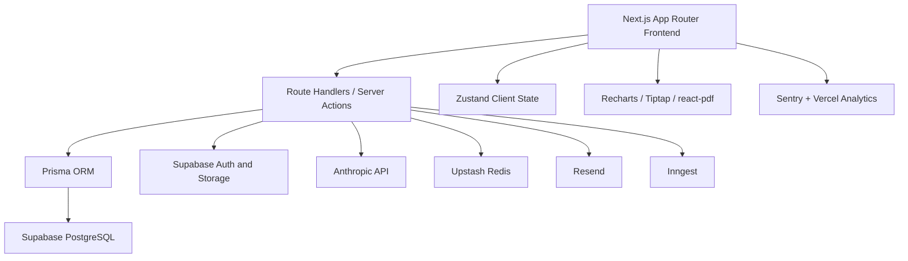
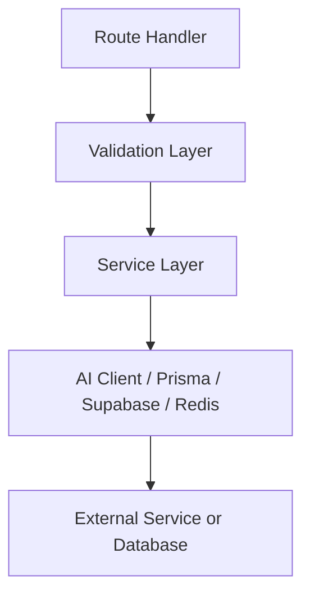
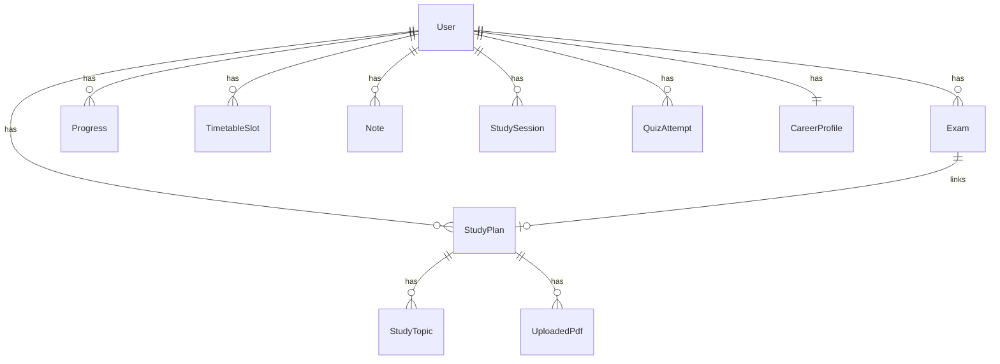

## 1. Architecture Design


## 2. Technology Description
- Frontend: Next.js 14 App Router + React 18 + TypeScript strict + Tailwind CSS v3 + shadcn/ui
- State management: Zustand for local dashboard state and interaction flow
- Forms and validation: React Hook Form + Zod
- Data and charts: Prisma client + Recharts
- Rich content: Tiptap for notes, react-pdf/pdfjs-dist for PDF preview and parsing
- Backend: Next.js route handlers, Node runtime for PDF parsing, Edge where lightweight and safe
- Database: Supabase PostgreSQL via Prisma
- Auth and storage: Supabase Auth with `@supabase/ssr`, Supabase Storage for uploaded PDFs
- AI: `@anthropic-ai/sdk` using `claude-sonnet-4-6`
- Async jobs: Inngest cron and event-driven functions
- Email: Resend with React Email templates
- Rate limiting: Upstash Redis + `@upstash/ratelimit`
- Monitoring and deployment: Vercel, Sentry, GitHub Actions

## 3. Route Definitions
| Route | Purpose |
|-------|---------|
| `/` | Public landing page with live plan demo, pricing, FAQ, and CTA |
| `/login` | User sign-in |
| `/signup` | User registration |
| `/onboarding` | First-time student setup flow |
| `/crunch` | AI study plan generation and review |
| `/planner` | Exam planner and countdown overview |
| `/timetable` | Weekly timetable builder with AI-generated suggestions |
| `/tracker` | Performance tracking and study analytics |
| `/career` | Career path guidance and milestone planning |
| `/notes` | Rich note editor with AI note tools |
| `/settings` | Profile, subjects, notifications, and account preferences |
| `/quiz` | Standalone quiz experience |

## 4. API Definitions
### 4.1 AI Routes
```ts
type CrunchRequest = {
  subject: string
  days: number
  hours: number
  level: "beginner" | "intermediate" | "advanced"
  examBoard?: string
  syllabusText: string
  pdfContent?: string
}

type TimetableRequest = {
  examList: Array<{ subject: string; examDate: string }>
  blockedSlots: Array<{ dayOfWeek: number; startTime: string; endTime: string; label: string }>
  startTime: string
  endTime: string
  sessionLength: number
  breakLength: number
  daysToNearestExam: number
}

type QuizRequest = {
  topicName: string
  subject: string
  contextText?: string
  count?: number
}

type CareerRequest = {
  subjects: string[]
  level: string
  country: string
  interests: string[]
  dreamCareer?: string
  gradeAmbitions: string
}
```

### 4.2 Domain Routes
```ts
type ExamPayload = {
  subject: string
  examBoard?: string
  level?: string
  examDate: string
  location?: string
  notes?: string
  color?: string
}

type ProgressPayload = {
  subject: string
  scorePercent: number
  examType?: string
  notes?: string
  recordedAt?: string
}

type UploadResponse = {
  fileName: string
  fileUrl: string
  parsedText?: string
  summary?: string
  pageCount?: number
}
```

## 5. Server Architecture Diagram


## 6. Data Model
### 6.1 Data Model Definition


### 6.2 Data Definition Notes
- Prisma schema follows the provided StudyPulse schema as the source of truth for MVP persistence.
- The MVP prioritises these persisted entities first: `User`, `Exam`, `StudyPlan`, `StudyTopic`, `UploadedPdf`, `Progress`, `TimetableSlot`, `Note`, `CareerProfile`, and `QuizAttempt`.
- Cache policy:
  - Study plans are reused when the same syllabus and timing inputs match an existing record.
  - Career profiles are reused until the student changes subjects or explicitly refreshes.
  - Weekly AI insights can be materialised or recomputed server-side based on freshness.
- Error response contract for all API routes:

```ts
type ApiError = {
  error: string
  code: string
  retryAfter?: number
}
```

## 7. MVP Delivery Scope
- Build a working MVP shell for all major pages in the spec.
- Implement the basic database schema, shared libraries, and route scaffolding needed to support the main flows.
- Prioritise working forms, sample analytics, and dependable CRUD/API wiring over advanced polish.
- Defer advanced production extras such as exhaustive background automation, full billing flows, and deeply interactive drag-resize behaviour if they slow MVP delivery.
